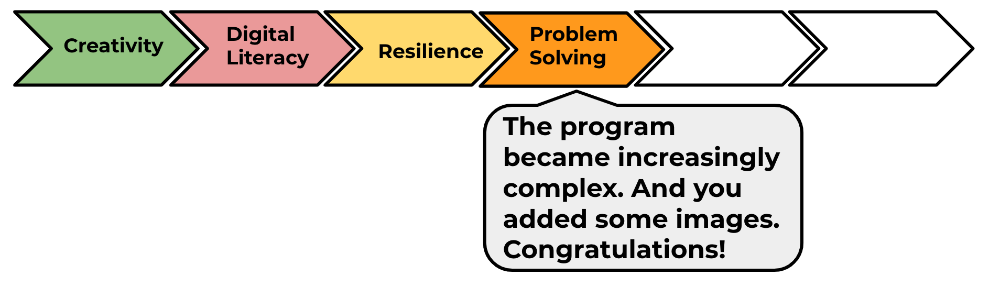

--- challenge ---
## Challenge: More styling
Can you add an image into your webpage? Or change the font? Here’s how your webpage could look:


Here’s some code that will help you:

```
font-family: Arial / Comic Sans MS / Courier / Impact / Tahoma;
font-size: 12pt;
font-weight: bold;


Go to the next project in the HTML & CSS module pathway: 'Mystery Letter'.

--- /challenge ---



Click on the 'Click me' button to try the next project:

<a href="https://codeclub.org/en/html1">

